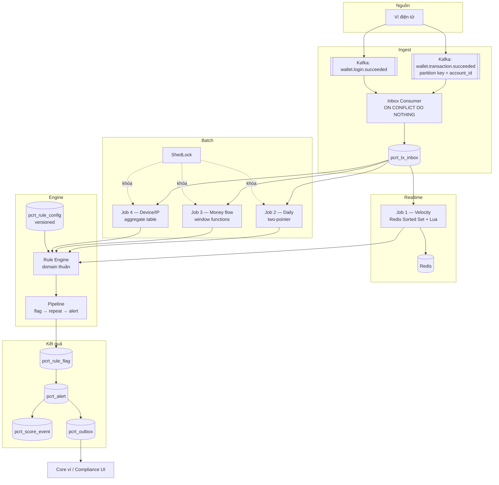

# Thiết kế — Hệ thống giám sát giao dịch nghi ngờ (Transaction Monitoring)

> Tài liệu thiết kế, không phải lộ trình học. Đi kèm `risk_transaction.md` (roadmap) và
> `risk_cif.md` (hệ thống sàng lọc khách hàng đã build).

---

## 0. Phạm vi & những thứ chưa có

### 0.1 Nguồn yêu cầu

`risk_transaction.md` là **roadmap học tập**, không phải spec nghiệp vụ. Nó tham chiếu tới một
"tài liệu rule" chứa 11 tiêu chí PCRT (nhắc tới "điểm 6.1", "6.5", "6.6") — **tài liệu đó không
có trong repo**.

Thiết kế dưới đây tái dựng yêu cầu từ các mảnh rải rác trong roadmap:

| Job | Tiêu chí suy ra được từ roadmap | Nguồn |
|---|---|---|
| **Job 1** | N giao dịch trong X phút → cảnh báo; lặp N=3 lần trong Y=1 ngày → escalate | Phase 2 |
| **Job 2 TH1** | ≥ 480 giao dịch / ngày | Phase 4 |
| **Job 2 TH2** | Nạp tích lũy ≥ 50tr trong cửa sổ ≤ 10 phút, sau đó rút/chuyển G1 ≥ 80% G | Phase 4, Phase 12 |
| **Job 2 TH3** | Nạp nhỏ nhiều lần → chuyển lớn | Phase 4 |
| **Job 3 TH1** | Nhiều ví nguồn dồn về 1 ví trong thời gian ngắn (fan-in) | Phase 5 |
| **Job 3 TH2** | Nhận tiền lớn bất thường so với baseline 10 ngày | Phase 5 |
| **Job 4 TH1** | 1 IP / device được ≥ 20 user dùng | Phase 6 |
| **Job 4 TH2.1/2.2** | Đăng nhập đa quốc gia | Phase 6 |
| **Job 4 TH3** | ≥ 90% giao dịch từ IP nước ngoài trong 30 ngày | Phase 6 |
| **Job 4 TH4** | ≥ 5 device, lặp ≥ 5 lần trong 30 ngày | Phase 6 |

Đó là 10 tiêu chí. Roadmap nói **11** → thiếu 1.

### 0.2 Câu hỏi phải chốt với BA trước khi code

| Mã | Câu hỏi | Ảnh hưởng |
|---|---|---|
| **T1** | Tiêu chí thứ 11 là gì? | phạm vi |
| **T2** | PCRT có **chặn** giao dịch không, hay chỉ quan sát? | §3 — quyết định toàn bộ kiến trúc |
| **T3** | Ngưỡng chính xác từng tiêu chí (N, X, Y, số tiền) và **biên `<` hay `≤`** | mọi rule |
| **T4** | Điểm rủi ro mỗi tiêu chí, ngưỡng escalate, có decay theo thời gian không | §8 |
| **T5** | Alert giao dịch có cộng vào điểm rủi ro **khách hàng** (hệ thống `risk_cif`) không, hay là hai chiều độc lập? | §2, §8 |
| **T6** | Chủ thể chấm điểm là **account** hay **CIF**? Một CIF nhiều ví thì gộp hay tách? | mô hình dữ liệu |
| **T7** | "Giao dịch" gồm những loại nào — nạp, rút, chuyển nội bộ, thanh toán, hoàn tiền? Giao dịch bị hủy/hoàn có tính không? | mọi rule |
| **T8** | Giữ dữ liệu giao dịch bao lâu (yêu cầu lưu trữ của NHNN)? | §5 partition/retention |
| **T9** | Job 3 TH2 baseline = 0 (khách hàng mới) xử lý thế nào? | §7.3 |
| **T10** | Hai rule cùng bắt một hành vi (TH2.1 và TH2.2) — cộng cả hai điểm hay lấy cái cao nhất? | §8 dedup |

**Ngưỡng trong tài liệu này là giá trị minh họa.** Tất cả đều nằm trong `pcrt_rule_config`, đổi
được lúc chạy — nên chưa có số cuối cùng vẫn thiết kế và code được.

### 0.3 Giả định về khối lượng

Lấy từ acceptance của Phase 4 ("1 triệu giao dịch trong 1 ngày"):

```
1.000.000 tx/ngày   ≈ 12 tx/s trung bình, ~120 tx/s giờ cao điểm
~400 byte/tx        ≈ 400 MB/ngày raw, ~150 GB/năm
Số account hoạt động: ~500.000
```

Ở mức này Postgres một node là đủ. §5 ghi rõ cái gì gãy trước khi lên 10× và 100×.

---

## 1. Vì sao đây không phải bài toán đã giải

Hệ thống `risk-assessment` đã build trả lời câu hỏi **"người này có nằm trong danh sách không"**.
Hệ thống này trả lời **"hành vi này có bất thường không"**. Hai bài toán khác nhau về bản chất:

| | `risk_cif` (đã build) | Transaction monitoring (mới) |
|---|---|---|
| Bản chất | kiểm tra thuộc tập hợp | phát hiện mẫu theo thời gian |
| Trạng thái | **không** — mỗi lần chấm độc lập | **có** — cửa sổ trượt, lịch sử, bộ đếm |
| Đầu vào | ảnh chụp thông tin KH | luồng sự kiện liên tục |
| Dữ liệu đối chiếu | danh sách tĩnh, đổi vài lần/tháng | chính lịch sử giao dịch, đổi từng giây |
| Chi phí một lần chấm | vài µs (tra hash) | ms → phút (quét cửa sổ, aggregate) |
| Sai lệch nguy hiểm nhất | false positive → khóa nhầm ví | false negative → lọt hành vi rửa tiền |
| Kết quả | điểm + lý do, ổn định | cảnh báo cần **người điều tra** |

**Hệ quả 1 — không tái dùng được matching engine.** `IdentityIndex`, `AttributeIndex`,
`CriteriaMatcher` giải bài toán tập hợp; ở đây vô dụng.

**Hệ quả 2 — nhưng tái dùng được rất nhiều thứ khác**, và đây là lý do nên xem hai hệ thống
là anh em chứ không phải người lạ:

| Đã có ở `risk-assessment` | Dùng lại thế nào |
|---|---|
| `pcrt_config` + `SchedulingConfigurer` cron động | y nguyên — job hàng ngày cũng cần |
| Pattern hàng đợi + partial index trên trạng thái | `pcrt_outbox`, hàng đợi alert |
| `customer_risk_result` append + `is_latest` | mô hình chấm điểm §8 |
| `CoreDispatchService`: retry + cầu dao + idempotency | gửi alert sang Core / hệ thống case management |
| Bài học "nguồn chân lý là DB, không phải biến trong tiến trình" | toàn bộ §7 |

**Hệ quả 3 — kết quả không giống nhau.** `risk_cif` cho ra một con điểm để Core khóa CIF.
Hệ thống này cho ra **cảnh báo cần người điều tra**. Không có cái gì tự động khóa ví dựa trên
"giao dịch 60 lần trong 5 phút" — đó có thể là một shop bán hàng thật. Vì vậy vòng đời alert
(§8) là một phần bắt buộc của thiết kế, không phải phần thêm.

---

## 2. Quyết định lớn nhất: tách service hay gộp vào `risk-assessment`?

**Đề xuất: tách deployable riêng, hội tụ ở tầng chấm điểm và alert.**

Lý do tách:

- **Hình thái tải hoàn toàn khác.** `risk-assessment` là batch đêm + REST thưa. Hệ thống này là
  luồng liên tục + job nặng. Chung một JVM thì batch quét 5 triệu khách hàng sẽ bóp nghẹt
  đường realtime — chính vấn đề mà `pcrtBatchExecutor` đã phải tách pool để tránh, giờ ở quy mô
  lớn hơn nhiều.
- **Hạ tầng khác.** Cái này cần Redis (cửa sổ trượt) và Kafka (ingest). `risk-assessment` không
  cần cái nào. Nhét vào sẽ buộc hệ thống đơn giản phải gánh phụ thuộc của hệ thống phức tạp.
- **Nhịp thay đổi khác.** Danh sách đen đổi vài lần/tháng. Ngưỡng rule giao dịch sẽ được
  compliance chỉnh liên tục trong 6 tháng đầu.

Lý do **phải** hội tụ:

- Cùng một khách hàng, cùng một cơ quan thanh tra. Khi bị hỏi "vì sao khách hàng này rủi ro
  cao", câu trả lời phải gộp cả hai nguồn.
- Cùng một đội compliance ngồi trước một màn hình.

```
┌────────────────────┐        ┌──────────────────────────┐
│  risk-assessment   │        │  transaction-monitoring  │
│  (sàng lọc KH)     │        │  (giám sát giao dịch)    │
│  danh sách ↔ KH    │        │  Kafka + Redis + batch   │
└─────────┬──────────┘        └────────────┬─────────────┘
          │  RiskFinding                   │  RiskFinding
          │  (CIF, nguồn, điểm, lý do)     │
          └───────────────┬────────────────┘
                          ▼
              ┌───────────────────────┐
              │  Case & Score store   │   ← nguồn chân lý duy nhất
              │  điểm tổng, alert,    │     về "rủi ro của khách hàng"
              │  vòng đời điều tra    │
              └───────────┬───────────┘
                          ▼
                    Core ví / Compliance UI
```

Ở quy mô project học, "Case & Score store" có thể là một module trong
transaction-monitoring; điều quan trọng là **contract `RiskFinding` được định nghĩa tách bạch**
ngay từ đầu, để tách ra sau này không phải viết lại.

---

## 3. Câu hỏi quyết định mọi thứ: PCRT có chặn giao dịch không?

Roadmap Phase 8 hỏi *"Redis chết — AML nên fail-open hay fail-closed?"*. Nhưng chính roadmap đã
tự trả lời ở Phase 1: topic là **`wallet.transaction.succeeded`** — thì quá khứ. Giao dịch **đã
xảy ra rồi** khi PCRT nhìn thấy nó.

Nếu đúng vậy thì đây là hệ thống **quan sát, không chặn**, và câu hỏi fail-open/fail-closed
không tồn tại — không có gì để chặn cả. Câu hỏi đúng là:

> **Sự kiện có bị mất không?**

Và câu trả lời phải là **không bao giờ**, kể cả khi Redis chết, engine chết, hay cả service chết.

Thiết kế theo đó:

```
Kafka ──► ghi pcrt_tx_inbox (Postgres, ON CONFLICT DO NOTHING) ──► commit offset
                        │
                        └──► đánh giá rule (Redis, engine)
                                  │
                                  ├─ thành công → đánh dấu processed_at
                                  └─ thất bại   → để nguyên, job quét lại
```

**Điểm mấu chốt: bền hóa trước, đánh giá sau.** Offset Kafka chỉ được commit sau khi sự kiện đã
nằm an toàn trong Postgres — chưa cần đánh giá xong. Redis chết thì `processed_at` vẫn NULL,
một job catch-up nhặt lại sau. Không mất gì, chỉ trễ.

Đây cũng là lý do inbox phải ở Postgres chứ không phải Redis: Redis là **bộ tăng tốc**, không
phải nơi lưu sự thật.

**Nếu T2 trả lời rằng PCRT *có* chặn giao dịch** thì toàn bộ thiết kế này phải làm lại: cần
budget độ trễ (p99 < 50ms), cần chế độ suy giảm, cần quyết định chặn hay cho qua khi engine
không trả lời kịp. **Hỏi BA câu này trước mọi thứ khác.**

---

## 4. Kiến trúc tổng thể



### Vì sao chia realtime / batch như vậy

| | Realtime (Job 1) | Batch hàng ngày (Job 2, 3, 4) |
|---|---|---|
| Vì sao | velocity mất giá trị nếu biết sau 1 ngày | cần nhìn trọn ngày mới kết luận được |
| Trạng thái | Redis (cửa sổ phút) | Postgres (cửa sổ ngày/tháng) |
| Đơn vị | 1 giao dịch | 1 account × 1 ngày |
| Chạy lại được | không (cửa sổ đã trôi) | **có, bắt buộc** |

Job 2/3/4 **không cần realtime**: "≥ 480 giao dịch trong ngày" chỉ kết luận được khi ngày đã hết.
Ép chúng chạy realtime là tự tạo độ phức tạp không đổi lấy giá trị nào.

---

## 5. Mô hình dữ liệu

### 5.1 Bảng cốt lõi

```sql
-- Chống trùng ở cửa ngõ. Ghi thô, chưa hiểu nội dung.
CREATE TABLE pcrt_tx_inbox (
    transaction_id  VARCHAR(64) PRIMARY KEY,
    payload         JSONB       NOT NULL,
    occurred_at     TIMESTAMPTZ NOT NULL,
    received_at     TIMESTAMPTZ NOT NULL DEFAULT now(),
    processed_at    TIMESTAMPTZ
);
CREATE INDEX idx_inbox_unprocessed ON pcrt_tx_inbox (occurred_at)
    WHERE processed_at IS NULL;          -- partial index, tự co theo tiến độ

-- Giao dịch đã chuẩn hóa. Phân vùng theo tháng.
CREATE TABLE pcrt_transaction (
    id                    BIGGENERATED ALWAYS AS IDENTITY,
    transaction_id        VARCHAR(64)  NOT NULL,
    account_id            VARCHAR(50)  NOT NULL,
    cif                   VARCHAR(50)  NOT NULL,
    counterparty_account  VARCHAR(50),
    direction             VARCHAR(3)   NOT NULL,   -- IN | OUT
    tx_type               VARCHAR(30)  NOT NULL,   -- TOPUP | WITHDRAW | P2P | PAYMENT
    amount                NUMERIC(18,0) NOT NULL,
    channel               VARCHAR(20),
    ip_address            INET,
    device_id             VARCHAR(100),
    occurred_at           TIMESTAMPTZ  NOT NULL,
    PRIMARY KEY (id, occurred_at)                  -- PK phải chứa cột phân vùng
) PARTITION BY RANGE (occurred_at);

CREATE UNIQUE INDEX uq_tx_txid ON pcrt_transaction (transaction_id, occurred_at);
CREATE INDEX idx_tx_account_time ON pcrt_transaction (account_id, occurred_at);
CREATE INDEX idx_tx_counterparty ON pcrt_transaction (counterparty_account, occurred_at)
    WHERE counterparty_account IS NOT NULL;
```

Ba lưu ý:

- **`amount` là `NUMERIC`, không phải `double`.** Tiền không bao giờ dùng dấu phẩy động. VND
  không có phần lẻ nên `NUMERIC(18,0)`.
- **Phân vùng theo tháng, không theo ngày.** 1M tx/ngày × 30 = 30M dòng/vùng — vừa tầm. Phân
  vùng theo ngày cho 13 tháng là 400 vùng, planner sẽ chậm hẳn.
- **Index `(account_id, occurred_at)` — thứ tự này bắt buộc.** Mọi rule đều lọc theo account rồi
  mới lọc theo thời gian. Đảo lại thì index vô dụng cho vế đầu.

```sql
-- Cấu hình rule, có phiên bản và hiệu lực theo thời gian
CREATE TABLE pcrt_rule_config (
    id             BIGSERIAL PRIMARY KEY,
    rule_code      VARCHAR(50)  NOT NULL,
    version        INT          NOT NULL,
    params         JSONB        NOT NULL,     -- {"n": 60, "windowMinutes": 5, "score": 3}
    effective_from TIMESTAMPTZ  NOT NULL,
    effective_to   TIMESTAMPTZ,
    enabled        BOOLEAN      NOT NULL DEFAULT TRUE,
    created_by     VARCHAR(100) NOT NULL,
    created_at     TIMESTAMPTZ  NOT NULL DEFAULT now(),
    CONSTRAINT uq_rule_version UNIQUE (rule_code, version)
);
CREATE UNIQUE INDEX uq_rule_active ON pcrt_rule_config (rule_code)
    WHERE effective_to IS NULL AND enabled;   -- mỗi rule đúng 1 cấu hình đang hiệu lực

-- Append-only. Không UPDATE, không DELETE. Thanh tra sẽ đọc bảng này.
CREATE TABLE pcrt_rule_config_audit (
    id          BIGSERIAL PRIMARY KEY,
    rule_code   VARCHAR(50)  NOT NULL,
    old_params  JSONB,
    new_params  JSONB        NOT NULL,
    changed_by  VARCHAR(100) NOT NULL,
    changed_at  TIMESTAMPTZ  NOT NULL DEFAULT now(),
    reason      VARCHAR(500)
);
```

**Vì sao cấu hình rule phải có phiên bản, khác với `pcrt_config` của `risk-assessment`:** khi
thanh tra hỏi "tháng 3 hệ thống dùng ngưỡng bao nhiêu", câu trả lời phải tra được. Sửa đè lên
một dòng thì lịch sử biến mất.

```sql
-- Vi phạm đơn lẻ. 7/11 tiêu chí cần đếm số lần vi phạm rồi mới cảnh báo.
CREATE TABLE pcrt_rule_flag (
    id              BIGSERIAL PRIMARY KEY,
    rule_code       VARCHAR(50)  NOT NULL,
    subject_type    VARCHAR(10)  NOT NULL,   -- ACCOUNT | CIF | DEVICE | IP
    subject_id      VARCHAR(100) NOT NULL,
    evaluation_date DATE         NOT NULL,
    metrics         JSONB        NOT NULL,   -- {"count": 63, "windowStart": "..."}
    tx_refs         VARCHAR(64)[],           -- transaction_id_refer
    rule_version    INT          NOT NULL,   -- cấu hình nào sinh ra flag này
    created_at      TIMESTAMPTZ  NOT NULL DEFAULT now(),
    -- Chạy lại job cho cùng một ngày KHÔNG được sinh flag thứ hai.
    CONSTRAINT uq_flag UNIQUE (rule_code, subject_type, subject_id, evaluation_date)
);
```

`uq_flag` là toàn bộ cơ chế idempotent của job hàng ngày. Không có nó, chạy lại job = cộng điểm
hai lần = báo cáo sai cho NHNN.

```sql
CREATE TABLE pcrt_alert (
    id            BIGSERIAL PRIMARY KEY,
    rule_code     VARCHAR(50)  NOT NULL,
    subject_type  VARCHAR(10)  NOT NULL,
    subject_id    VARCHAR(100) NOT NULL,
    severity      VARCHAR(20)  NOT NULL,
    score         SMALLINT     NOT NULL,
    status        VARCHAR(30)  NOT NULL DEFAULT 'NEW',
    assignee      VARCHAR(100),
    dedup_key     VARCHAR(200) NOT NULL,
    version       INT          NOT NULL DEFAULT 0,   -- optimistic locking
    created_at    TIMESTAMPTZ  NOT NULL DEFAULT now(),
    CONSTRAINT uq_alert_dedup UNIQUE (dedup_key)
);

-- Append-only. Ai đổi trạng thái gì, khi nào, vì sao.
CREATE TABLE pcrt_alert_transition (
    id          BIGSERIAL PRIMARY KEY,
    alert_id    BIGINT       NOT NULL REFERENCES pcrt_alert(id),
    from_status VARCHAR(30),
    to_status   VARCHAR(30)  NOT NULL,
    actor       VARCHAR(100) NOT NULL,
    note        VARCHAR(1000),
    created_at  TIMESTAMPTZ  NOT NULL DEFAULT now()
);
```

### 5.2 Bảng tổng hợp — không phải tối ưu, là bắt buộc

```sql
CREATE TABLE pcrt_daily_account_summary (
    account_id       VARCHAR(50) NOT NULL,
    summary_date     DATE        NOT NULL,
    tx_count         INT         NOT NULL,
    total_in         NUMERIC(18,0) NOT NULL,
    total_out        NUMERIC(18,0) NOT NULL,
    distinct_sources INT         NOT NULL,
    PRIMARY KEY (account_id, summary_date)
);

CREATE TABLE pcrt_device_daily (
    activity_date DATE         NOT NULL,
    ip_address    INET,
    device_id     VARCHAR(100),
    account_id    VARCHAR(50)  NOT NULL,
    country_code  VARCHAR(2),
    tx_count      INT          NOT NULL,
    PRIMARY KEY (activity_date, ip_address, device_id, account_id)
);
```

**Vì sao bắt buộc:** Job 4 TH1 hỏi "IP nào có ≥ 20 user". Chạy câu đó trên bảng raw mỗi ngày là
quét toàn bộ giao dịch của 30 ngày. Trên bảng tổng hợp, cùng câu hỏi đó là một `GROUP BY` trên
tập nhỏ hơn hai bậc độ lớn. Tương tự Job 3 TH2 cần baseline 10 ngày — đọc từ summary thay vì
tính lại từ raw mỗi lần.

Bảng tổng hợp được cập nhật cuối mỗi ngày, và **phải tính lại được từ raw** — nếu nó lệch thì
phải có đường sửa.

### 5.3 Lưu trữ

| Dữ liệu | Nóng | Sau đó |
|---|---|---|
| `pcrt_tx_inbox` | 7 ngày | xóa (đã chuẩn hóa sang `pcrt_transaction`) |
| `pcrt_transaction` | 13 tháng | `DETACH PARTITION` → S3/cold storage |
| `pcrt_rule_flag`, `pcrt_alert` | vĩnh viễn | — |
| Audit config, alert transition | vĩnh viễn, bất biến | — |

13 tháng nóng vì rule dài nhất là 30 ngày, cộng biên an toàn cho việc điều tra ngược và đối
chiếu năm trước. **T8 phải xác nhận với BA** — yêu cầu lưu trữ của NHNN có thể dài hơn.

### 5.4 Cái gì gãy khi tăng quy mô

| Quy mô | Gãy ở đâu | Xử lý |
|---|---|---|
| 1M tx/ngày | — | thiết kế này đủ |
| 10M tx/ngày | Job 3 fan-in `COUNT(DISTINCT)` | lọc ứng viên (§7.3), summary theo giờ |
| 100M tx/ngày | Postgres một node | Kafka Streams / Flink cho cửa sổ, Postgres chỉ giữ alert |

---

## 6. Rule engine

### 6.1 SPI

```java
public interface Rule {
    RuleCode code();
    RuleScope scope();            // ACCOUNT | CIF | DEVICE | IP
    RuleTrigger trigger();        // REALTIME | DAILY
    RuleOutcome evaluate(RuleContext ctx, RuleParams params);
}

public sealed interface RuleOutcome {
    record NoMatch() implements RuleOutcome {}
    record Flagged(Map<String, Object> metrics, List<String> txRefs) implements RuleOutcome {}
    record Alerted(int score, String reason, List<String> txRefs) implements RuleOutcome {}
}
```

Domain thuần, không Spring, không JPA. Không phải để "sạch" — mà vì rule là chỗ **logic nghiệp
vụ đắt nhất** nằm, và nó phải chạy được ngoài container để thử nhanh hàng trăm kịch bản.

*(Lưu ý: `risk-assessment` hiện không dùng `record` theo yêu cầu của bạn — giữ nhất quán thì
đổi sang class Lombok + `sealed`.)*

### 6.2 Pipeline dùng chung — phần giá trị nhất của thiết kế

7/11 tiêu chí theo đúng một mẫu: **vi phạm → đếm số lần lặp N trong Y ngày → cảnh báo**. Viết
7 lần là 7 chỗ để sai lệch nhau.

```
evaluate() → Flagged
    │
    ▼
INSERT INTO pcrt_rule_flag ... ON CONFLICT DO NOTHING     ← idempotent tại đây
    │
    ▼
SELECT count(*) FROM pcrt_rule_flag
 WHERE rule_code=? AND subject_id=? AND evaluation_date > now() - Y
    │
    ├─ < N → dừng
    └─ ≥ N → raiseAlert(dedup_key)                        ← idempotent tại đây
```

Hai chốt idempotent (`uq_flag` và `uq_alert_dedup`) đều là **UNIQUE constraint trong DB**, không
phải câu "SELECT rồi IF" trong code. Hai job chạy song song sẽ cùng vượt qua câu kiểm tra kiểu
đó — đúng bài học từ `INSERT ... ON CONFLICT` của Phase 1.

### 6.3 Cấu hình đổi lúc chạy

Cache `RuleParams` trong bộ nhớ, TTL 30s, hoặc invalidate qua Redis Pub/Sub. **Nhưng:** một lần
chạy job phải dùng **một phiên bản cấu hình duy nhất** từ đầu đến cuối, và ghi `rule_version`
vào flag. Nếu nửa chừng batch mà compliance đổi ngưỡng, nửa đầu và nửa sau chấm bằng hai luật
khác nhau — không giải trình được. Đây đúng là bài học `WatchlistSnapshot` ở `risk-assessment`,
áp lại cho cấu hình thay vì cho danh sách.

---

## 7. Bốn nhóm job — phần khó của từng cái

### 7.1 Job 1 — Velocity realtime

Cấu trúc Redis:

```
key    = pcrt:vel:{account_id}
score  = occurred_at (epoch millis)   ← từ EVENT, không phải đồng hồ của pod
member = transaction_id
```

Toàn bộ nằm trong **một Lua script**: `ZREMRANGEBYSCORE` (dọn hết hạn) → `ZADD` → `ZCARD` →
nếu vượt ngưỡng thì `ZREMRANGEBYSCORE` tới giao dịch cuối cùng đã đếm. Redis đơn luồng nên
script chạy trọn vẹn, không bị chen ngang. Tách thành nhiều lệnh thì hai pod sẽ đọc cùng một
giá trị và cùng kết luận vi phạm.

**Một cú `ZREMRANGEBYSCORE` giải quyết cả hai bài toán khó cùng lúc.** Roadmap liệt kê chúng
riêng:

- *continuation* — sau khi vi phạm, cửa sổ tiếp theo bắt đầu từ giao dịch ngay sau giao dịch
  cuối cùng đã đếm;
- *chống đếm trùng* — giao dịch đã vào cảnh báo không được tính lại.

Cả hai là cùng một yêu cầu nhìn từ hai phía: **giao dịch đã tiêu thụ thì rời khỏi cửa sổ**. Xóa
chúng khỏi sorted set ngay khi cảnh báo được sinh là xong cả hai, không cần cột
`counted_in_alert_id` nào.

Ba điểm khác:

- **`EXPIRE` cho mọi key.** Account ngừng hoạt động mà key còn → rò rỉ bộ nhớ. TTL = cửa sổ × 2.
- **Sự kiện đến muộn.** Dùng `occurred_at` của sự kiện là đúng, nhưng một sự kiện trễ 10 phút
  sẽ rơi vào cửa sổ đã đóng. Chính sách: chấp nhận trễ tới ngưỡng G (ví dụ 5 phút), quá thì
  chuyển cho job hàng ngày xử lý. Phải ghi rõ, đừng để ngầm định.
- **Redis chết.** Xem §3 — sự kiện đã nằm trong inbox Postgres, `processed_at` để NULL, job
  catch-up nhặt lại. Không mất, chỉ trễ.

### 7.2 Job 2 TH2 — nạp vào rút ra nhanh

Bài toán: tìm cửa sổ **nhỏ nhất** có tổng nạp tích lũy ≥ 50tr; nếu cửa sổ ≤ 10 phút thì tìm
tiếp giao dịch rút/chuyển trong cửa sổ đó, tính tỉ lệ G1/G.

Vì mọi số tiền đều dương, tổng tiền tố đơn điệu tăng → **two pointers**, O(n) thay vì O(n²):

```
left = 0; sum = 0
for right in 0..n-1:
    sum += tx[right].amount
    while sum >= THRESHOLD:
        ghi nhận cửa sổ [left, right]
        sum -= tx[left].amount
        left += 1
```

Các biên phải viết test riêng: đúng 10 phút (`<` hay `≤` — **T3**), nhiều giao dịch cùng
millisecond, một giao dịch đơn lẻ đã ≥ 50tr.

### 7.3 Job 3 — Money flow

**TH1 fan-in.** Cần đếm **số ví nguồn phân biệt** dồn về một ví trong cửa sổ trượt.
`COUNT(DISTINCT ...) OVER (...)` Postgres không hỗ trợ.

Cách rẻ nhất không phải là viết câu SQL khéo hơn, mà là **lọc ứng viên trước**:

```sql
-- Bước 1 (rẻ): ví nào nhận đủ nhiều giao dịch để CÓ THỂ vi phạm?
WITH candidates AS (
    SELECT account_id
    FROM pcrt_daily_account_summary
    WHERE summary_date = :d AND tx_count >= :minTx
)
-- Bước 2 (đắt): chỉ chạy trên vài trăm ứng viên, không phải 500.000 account
SELECT c.account_id, count(DISTINCT t.counterparty_account) AS src
FROM candidates c
JOIN pcrt_transaction t ON t.account_id = c.account_id
WHERE t.occurred_at >= :from AND t.occurred_at < :to AND t.direction = 'IN'
GROUP BY c.account_id
HAVING count(DISTINCT t.counterparty_account) >= :minSources;
```

Số ví nhận ≥ 20 giao dịch trong vài giờ là rất nhỏ so với tổng số ví. Đây là mẫu tổng quát cho
mọi rule đắt: **một câu rẻ để thu hẹp, một câu đắt trên tập đã hẹp.**

**TH2 baseline.** Window function chuẩn:

```sql
SUM(total_in) OVER (
    PARTITION BY account_id ORDER BY summary_date
    ROWS BETWEEN 10 PRECEDING AND 1 PRECEDING
)
```

`1 PRECEDING` chứ không phải `CURRENT ROW` — baseline phải **loại chính ngày đang xét**, nếu
không giao dịch bất thường tự kéo baseline lên và tự che chính nó.

**Baseline = 0 (T9).** Khách hàng mới nạp lần đầu 100tr sẽ có tỉ lệ vô hạn → cảnh báo. Đề xuất:
yêu cầu tối thiểu K ngày có hoạt động (ví dụ 3) mới áp dụng rule tỉ lệ; dưới ngưỡng đó dùng
ngưỡng tuyệt đối. Phải chốt với BA — đây là quyết định nghiệp vụ, không phải kỹ thuật.

### 7.4 Job 4 — Device / IP

- Đọc từ `pcrt_device_daily`, không bao giờ từ raw.
- Kiểu `INET` của Postgres cho phép truy vấn theo dải mạng, hữu ích khi whitelist CGNAT.
- **False positive là vấn đề chính, không phải hiệu năng.** CGNAT khiến hàng nghìn user chung
  một IP công cộng một cách hoàn toàn hợp pháp; VPN làm GeoIP nói dối. Cần whitelist dải IP và
  chấp nhận rằng Job 4 có tỉ lệ nhiễu cao hơn hẳn ba job kia — phản ánh vào điểm số, đừng cho
  nó cùng trọng số với Job 2/3.
- **Chồng lấn TH2.1/TH2.2 (T10):** `dedup_key = hash(subject, rule_family, date)` — cùng một
  hành vi chỉ sinh một alert, lấy severity cao nhất trong họ.

---

## 8. Chấm điểm & vòng đời alert

### 8.1 Lưu sự kiện điểm, đừng lưu điểm

```sql
CREATE TABLE pcrt_score_event (
    id           BIGSERIAL PRIMARY KEY,
    subject_type VARCHAR(10)  NOT NULL,
    subject_id   VARCHAR(100) NOT NULL,
    rule_code    VARCHAR(50)  NOT NULL,
    alert_id     BIGINT       REFERENCES pcrt_alert(id),
    points       SMALLINT     NOT NULL,
    occurred_at  TIMESTAMPTZ  NOT NULL
);
```

Điểm hiện tại = tổng có trọng số trên cửa sổ trượt (ví dụ 90 ngày), **tính khi cần**, không lưu
một con số chạy dồn.

Ba lý do:

1. **Decay đổi được về sau.** Compliance muốn "điểm cũ hơn 60 ngày giảm một nửa"? Đổi công thức,
   dữ liệu cũ vẫn dùng được. Với một con số dồn thì không thể tính ngược.
2. **Giải trình được.** Thanh tra hỏi "vì sao 15 điểm" → liệt kê từng sự kiện. Với biến dồn thì
   câu trả lời là "vì nó là 15".
3. **Không có cập nhật cạnh tranh.** Không có `UPDATE score = score + 3` để hai job giẫm chân.

### 8.2 Vòng đời alert

```
NEW ──► ASSIGNED ──► INVESTIGATING ──┬──► CLOSED_TRUE_POSITIVE ──► báo cáo STR
                                     └──► CLOSED_FALSE_POSITIVE ──► phản hồi tinh chỉnh rule
```

- Chuyển trạng thái bằng `UPDATE ... WHERE id=? AND status=?` — trạng thái nguồn nằm trong mệnh
  đề `WHERE`, nên chuyển sai trạng thái trả về 0 dòng thay vì âm thầm ghi đè.
- Optimistic locking `@Version` cho việc gán analyst: hai người cùng nhận một case → một người
  nhận 409.
- Nhánh `CLOSED_FALSE_POSITIVE` phải quay lại thành dữ liệu tinh chỉnh ngưỡng. Không có vòng
  phản hồi đó thì tỉ lệ nhiễu chỉ có tăng, và đội compliance sẽ ngừng đọc alert — lúc đó hệ
  thống coi như đã chết dù vẫn chạy.

---

## 9. Chế độ hỏng

| Hỏng gì | Hậu quả | Xử lý |
|---|---|---|
| Redis chết | Job 1 không đánh giá được | Sự kiện đã ở inbox, `processed_at` NULL, catch-up job nhặt lại (§3) |
| Kafka chết | Không nhận được sự kiện mới | Ví buffer phía nó; PCRT không mất gì đã nhận |
| Job hàng ngày chết giữa chừng | Chấm dở | `uq_flag` khiến chạy lại an toàn; ShedLock `lockAtMostFor` để pod chết không giữ khóa vĩnh viễn |
| Hai pod cùng chạy một job | Cộng điểm hai lần | ShedLock + `uq_flag` — **hai lớp**, vì ShedLock có thể hỏng khi clock lệch |
| Core / hệ thống case chết | Alert không gửi được | Outbox + relay `FOR UPDATE SKIP LOCKED`, đúng mẫu `CoreDispatchService` đã làm |
| Sự kiện đến muộn | Rơi ngoài cửa sổ realtime | Ngưỡng chấp nhận trễ G; quá thì để job hàng ngày bắt |
| Đồng hồ pod lệch | Đếm sai cửa sổ | Luôn dùng `occurred_at` của sự kiện; `Clock` inject được để test |

**Mẫu chung:** mỗi cơ chế chống trùng đều có **hai lớp** — một lớp ứng dụng (ShedLock, kiểm tra
trong code) và một lớp DB (UNIQUE constraint). Lớp ứng dụng nhanh và cho thông báo lỗi đẹp; lớp
DB là lớp thực sự đúng. Đây đúng bài học từ `uq_result_latest_per_cif` và `uq_queue_batch_cif`.

---

## 10. Thứ tự xây

| Bước | Làm gì | Vì sao trước |
|---|---|---|
| 1 | Hỏi BA **T2** (có chặn giao dịch không) | Trả lời khác đi thì kiến trúc khác hẳn |
| 2 | Ingest + inbox idempotent | Không có dữ liệu tin cậy thì mọi rule đều vô nghĩa |
| 3 | Rule engine SPI + pipeline `flag → repeat → alert` | 7/11 tiêu chí dùng chung; xây sau là phải sửa 7 chỗ |
| 4 | **Job 2 TH1** (đếm giao dịch/ngày) | Rule đơn giản nhất — dùng để kiểm chứng cả đường ống |
| 5 | Job 1 velocity | Phần khó nhất, làm khi đường ống đã chắc |
| 6 | Vòng đời alert + API | Không có nó thì alert không ai xử lý |
| 7 | Job 3, Job 4 | Cần bảng tổng hợp, mà bảng tổng hợp cần dữ liệu tích lũy |
| 8 | Outbox + resilience | Chỉ có ý nghĩa khi đã có thứ để gửi |

**Bước 4 quan trọng hơn vẻ ngoài của nó.** "Đếm giao dịch trong ngày ≥ 480" là rule tầm thường
— và chính vì tầm thường nên nó là thứ tốt nhất để chứng minh toàn bộ đường ống chạy đúng: sự
kiện vào, chuẩn hóa, chấm, sinh flag, đếm lặp, sinh alert, gửi đi. Bắt đầu bằng Job 1 sẽ trộn
lẫn cái khó của Redis với cái khó của đường ống, và khi hỏng sẽ không biết hỏng ở đâu.

---

## 11. Cái gì tái dùng thẳng từ `risk-assessment`

| Đã có | Áp vào đâu |
|---|---|
| `PcrtConfigService` + `SchedulingConfigurer` cron động | lịch chạy Job 2/3/4 |
| `WatchlistSnapshot` — chụp cấu hình một lần mỗi lần chạy | ảnh chụp `RuleParams` mỗi batch (§6.3) |
| Partial index trên trạng thái đang hoạt động | `pcrt_tx_inbox`, `pcrt_outbox` |
| `CoreDispatchService` — retry + cầu dao + idempotency key ổn định | gửi alert đi |
| `CoreDispatchWriter` — bean riêng cho `@Transactional` | mọi vòng lặp batch |
| `requeue-failed` cho bản ghi hết lượt | hàng đợi outbox |
| Keyset pagination trong `CoreCustomerRepository` | reader của Spring Batch |

Bảy thứ trên là **cùng một bộ bài học** áp vào một miền nghiệp vụ khác. Đó cũng là điều đáng nói
nhất khi kể lại project: không phải "tôi đã build hai hệ thống", mà "tôi nhận ra hai hệ thống
này chia sẻ cùng một tập vấn đề hạ tầng, và tôi đã trừu tượng hóa chúng".
