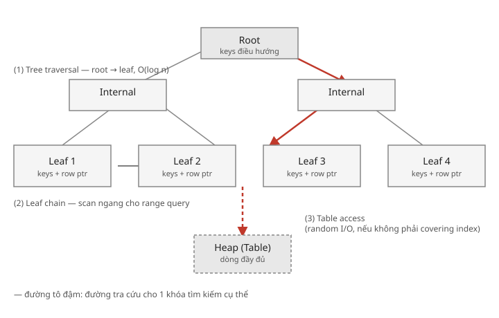
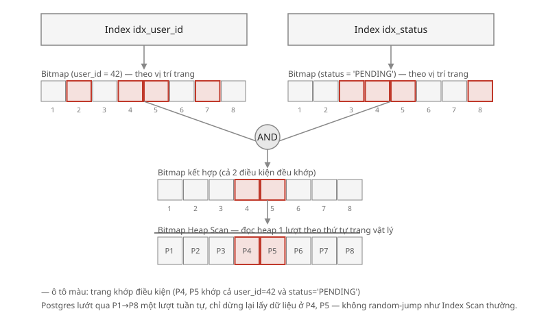
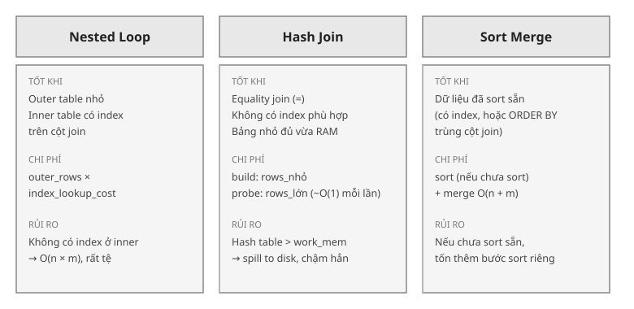

# SQL Nâng Cao — Index, Query Optimization & Performance

> Ghi chú từ buổi học 1-kèm-1, tập trung vào PostgreSQL. Điểm xuất phát: viết SQL hàng ngày nhưng chưa từng chạy `EXPLAIN`, chưa hiểu tại sao query chậm.

Thư mục này gồm:
- `README.md` — ghi chú lý thuyết + ví dụ đã học
- `diagrams/` — các sơ đồ minh họa (mở trực tiếp bằng trình duyệt)
- `roadmap-goc.md` — lộ trình gốc (đầy đủ 4 module) dùng để tham chiếu / ôn tập

---

## Module 01 — Index & B+Tree Fundamentals

### Tại sao query chậm: Full Table Scan vs Index Scan

Không có index trên cột lọc → Postgres phải đọc **từng dòng một** để kiểm tra điều kiện (`Seq Scan`). Cái đắt không phải là CPU so sánh giá trị — mà là **số lần đọc đĩa (I/O)**. Đọc 1 block dữ liệu từ đĩa tốn thời gian gấp hàng nghìn lần so với một phép so sánh CPU.

> Nếu không có `LIMIT`, Postgres không biết trước có bao nhiêu dòng khớp nên bắt buộc phải quét hết toàn bộ bảng.

### Cấu trúc B+Tree



- **Root / Internal node**: chỉ chứa key để định hướng, không chứa data thật.
- **Leaf node**: chứa key + con trỏ đến dòng dữ liệu, và được **nối thành chuỗi** (linked list) để range query quét ngang hiệu quả.

**3 bước của một Index Lookup:**
1. **Tree traversal** — root → leaf, O(log n)
2. **Leaf chain scan** — quét ngang qua các leaf liên tiếp (chỉ cần cho range query)
3. **Table access** — nhảy về heap lấy dòng đầy đủ (random I/O, chỉ cần nếu index không "covering")

### Tại sao leaf chain giúp range query nhanh

Ví dụ index trên `amount`, các leaf đã sort: `Leaf1[10,20,30] → Leaf2[40,50,60] → Leaf3[70,80,90] → Leaf4[100,110,120]`.

Query `WHERE amount BETWEEN 45 AND 85`:
- Traversal **một lần duy nhất** để tìm điểm bắt đầu (45) → landing ở Leaf2.
- Từ đó **đi ngang** qua leaf chain: đọc `50, 60` (Leaf2) → nhảy sang Leaf3 → đọc `70, 80` → gặp `90` vượt ngưỡng thì dừng.

Không có leaf chain, muốn lấy dòng tiếp theo trong range sẽ phải traverse lại từ root **mỗi lần** — với 1000 dòng thỏa điều kiện thì tốn ~1000 lần traversal thay vì 1.

### Đọc EXPLAIN cơ bản

```sql
EXPLAIN ANALYZE SELECT * FROM orders WHERE id = 123;
```
```
Index Scan using orders_pkey on orders  (cost=0.29..8.31 rows=1 width=120) (actual time=0.025..0.027 rows=1 loops=1)
  Index Cond: (id = 123)
```

| Phần | Ý nghĩa |
|---|---|
| `Index Scan` / `Seq Scan` | loại node — `Seq Scan` là red flag |
| `cost=0.29..8.31` | **ước tính** trước khi chạy: chi phí lấy dòng đầu .. tổng chi phí |
| `rows=1` (trong cost) | số dòng **planner dự đoán** |
| `actual time=0.025..0.027` | thời gian **thật**: lấy dòng đầu .. hoàn thành toàn bộ node |
| `rows=1 loops=1` (actual) | số dòng thật trả về, số lần node này chạy |
| `Index Cond` | điều kiện áp dụng **ngay khi traverse index** |

### Leftmost Prefix Rule

Composite index `(a, b, c)` chỉ dùng được nếu điều kiện WHERE bắt đầu từ `a` — giống danh bạ điện thoại sort theo họ trước: tìm "Nguyễn" rất nhanh, nhưng không thể nhảy thẳng vào giữa sách nếu chỉ có tên đệm.

```sql
-- Index (status, user_id)
WHERE status = 'ACTIVE' AND user_id = 5   -- ✅ dùng được
WHERE user_id = 5                          -- ❌ không dùng được
```

### Composite Index: Equality trước, Range sau

```sql
WHERE status = 'ACTIVE' AND created_at > '2024-01-01'
```

- Index `(status, created_at)` — **đúng**: toàn bộ `ACTIVE` nằm gọn trong một khối liên tục của cây, tách biệt hẳn khỏi `PENDING`. Cả 2 điều kiện đều thu hẹp phạm vi quét.
- Index `(created_at, status)` — **sai**: cây sort theo `created_at` trước, nên các dòng `ACTIVE`/`PENDING` xen kẽ nhau theo thời gian. `status` không hề thu hẹp phạm vi leaf phải quét — chỉ lọc *sau khi* đã đọc.

Nếu `ACTIVE` chỉ chiếm 1% dữ liệu, chênh lệch giữa 2 cách này là rất lớn.

---

## Module 02 — Query Optimization

### Bitmap Scan — kết hợp nhiều index



Khi 2 điều kiện nằm trên 2 index riêng biệt (không phải composite):
1. Scan từng index → tạo **bitmap** đánh dấu vị trí (trang) khớp điều kiện, chưa đụng heap.
2. **AND/OR** các bitmap lại → chỉ giữ vị trí khớp tất cả điều kiện.
3. **Bitmap Heap Scan**: đọc heap **một lượt theo thứ tự trang vật lý** (không theo thứ tự index) → biến nhiều lần random I/O thành ít lần đọc tuần tự hơn.

Chỉ đáng giá khi có **nhiều dòng khớp, rải rác khắp bảng**. Nếu chỉ khớp vài dòng, Index Scan thường (nhảy thẳng từng dòng) đã đủ rẻ — dựng bộ máy bitmap không đáng.

### 6 Red Flags trong Execution Plan

1. `Seq Scan` trên bảng lớn
2. `Hash Join` trên bảng không có index ở cột join
3. `Sort` không bị loại bỏ bởi index (filesort)
4. `Nested Loop` với outer table lớn và inner table không có index
5. `rows=1` (actual) nhưng `rows=10000` (estimated) → thống kê cũ → cần chạy `ANALYZE`
6. `Buffers: hit=0 read=...` lớn → cache miss, I/O bound

### SARGable, Expression Index, Over-indexing

B+Tree sort theo **giá trị gốc** của cột. Nếu bọc cột trong một hàm, cây không biết trước kết quả hàm đó là gì → không traverse được → Seq Scan.

```sql
-- ❌ Non-SARGable
WHERE YEAR(created_at) = 2024
WHERE SUBSTRING(phone, 1, 3) = '090'

-- ✅ Viết lại (SARGable) — không đổi index
WHERE created_at >= '2024-01-01' AND created_at < '2025-01-01'
WHERE phone LIKE '090%'
```

Khi không viết lại được (vd `LOWER(email)`), dùng **Expression Index** — cây sort theo *kết quả của biểu thức*:

```sql
CREATE INDEX idx_email_lower ON users (LOWER(email));
-- Chỉ dùng được khi query CŨNG viết LOWER(email) = ...
-- WHERE email = '...' (không có LOWER) sẽ KHÔNG dùng index này
```

**Over-indexing**: mỗi index là một khoản "thuế" cho `INSERT`/`UPDATE`/`DELETE`. Chỉ tạo khi có query cụ thể cần.

### Plan Caching: Generic vs Custom Plan

- **Custom Plan**: lập lại từ đầu, dành riêng cho giá trị tham số của lần gọi đó — dùng thống kê thật, tối ưu chính xác cho giá trị này.
- **Generic Plan**: lập một lần (không biết trước giá trị), dùng thống kê trung bình, tái sử dụng cho mọi lần gọi — nhanh hơn nhưng có thể không tối ưu.

Postgres chạy 5 lần đầu bằng Custom Plan, so sánh chi phí, rồi quyết định có chuyển sang Generic Plan cố định hay không.

- Dữ liệu **lệch** (vd `status`: 99% COMPLETED, 1% REFUNDED) → tiếp tục dùng Custom Plan, vì một Generic Plan không thể tối ưu cho cả 2 giá trị.
- Dữ liệu **đều** → Generic Plan đã đủ tốt, không cần lập lại mỗi lần.

> Prepared statement / parameterized query không chỉ chống SQL Injection mà còn **enable** cơ chế cache plan này.

### Partial Index

Chỉ index một tập con dữ liệu — hữu ích khi query luôn lọc trên một giá trị hiếm:

```sql
CREATE INDEX idx_payments_pending ON payments (created_at)
WHERE status = 'PENDING';
-- Index chỉ chứa 1% dữ liệu → B+Tree cực nhỏ, cực nhanh cho đúng query đó
-- Nhưng KHÔNG dùng được cho WHERE status = 'COMPLETED'
```

### NULL Trap: `NOT IN` vs `NOT EXISTS`

```sql
-- ❌ Nguy hiểm
SELECT * FROM orders WHERE user_id NOT IN (SELECT user_id FROM blacklist);
```

Nếu `blacklist.user_id` có dù chỉ **một** dòng NULL, biểu thức `3 = NULL` không phải FALSE mà là **UNKNOWN** (SQL dùng logic 3 giá trị: TRUE / FALSE / UNKNOWN). `FALSE OR FALSE OR UNKNOWN = UNKNOWN`, và `WHERE` loại bỏ UNKNOWN giống FALSE → **toàn bộ kết quả rỗng**, dù các `user_id` khác rõ ràng không nằm trong blacklist.

```sql
-- ✅ An toàn — NULL trong subquery không "đầu độc" điều kiện
SELECT * FROM orders o
WHERE NOT EXISTS (SELECT 1 FROM blacklist b WHERE b.user_id = o.user_id);
```

---

## Module 03 — Join & Clustering



### Nested Loop Join
```
Với mỗi dòng trong outer table:
    Với mỗi dòng trong inner table khớp điều kiện join:
        emit kết quả
```
Tốt khi outer nhỏ + inner có index (traverse B+Tree thay vì quét). Không có index ở inner → O(n × m), rất tệ.

### Hash Join
1. **Build**: hash toàn bộ bảng **nhỏ hơn** vào RAM.
2. **Probe**: quét bảng lớn hơn một lượt, tra hash table (~O(1) mỗi lần).

Tốt cho equality join không có index phù hợp. Rủi ro: nếu bảng build vượt quá `work_mem` → spill to disk, chậm hẳn.

### Sort Merge Join

Sort cả 2 bảng theo cột join, rồi dùng **2 con trỏ chạy tới** (không bao giờ lùi) để merge — giống bước merge của merge sort:

```
orders.id:              1    3    5    7    9
order_items.order_id:   1  3  3  7

i=1,j=1 → 1==1 → match, j++
i=3,j=3 → 3==3 → match, j++ (còn 3 nữa) → 3==3 → match, j++
i=5,j=7 → 5<7  → order 5 không có item → i++
i=7,j=7 → 7==7 → match, j hết
i=9     → hết j → dừng
```

Mỗi bảng chỉ duyệt **một lượt** → chi phí ≈ n + m, thay vì n × m. Tốt nhất khi dữ liệu **đã sort sẵn** (nhờ index, hoặc `ORDER BY` trùng cột join — "ăn theo" không tốn thêm bước sort).

### Giảm số dòng trước khi join (Predicate Pushdown)

Planner tự động đẩy điều kiện `WHERE` xuống lọc **trước khi join**, miễn là có index hỗ trợ:

```sql
SELECT * FROM orders o
JOIN order_items oi ON o.id = oi.order_id
WHERE o.status = 'PENDING';
```
Nếu `orders.status` có index → Postgres lọc `orders` xuống còn ít dòng **trước**, rồi mới join (Nested Loop với outer nhỏ) — thay vì join hết 1 triệu × 1 triệu rồi mới lọc.

Không có index → vẫn phải Seq Scan để lọc, nhưng **chỉ một lần** (rẻ hơn nhiều so với không đẩy predicate xuống). Khi logic lọc phức tạp, có thể chủ động viết CTE lọc trước:

```sql
WITH pending_orders AS (
  SELECT id FROM orders WHERE status = 'PENDING'
)
SELECT * FROM pending_orders po
JOIN order_items oi ON po.id = oi.order_id;
```

### Index Condition vs Index Filter, Index-Only Scan

```
Index Scan using idx_orders_user_status on orders (...) (actual time=... rows=3 loops=1)
  Index Cond: ((user_id = 42) AND (status = 'PENDING'::text))
  Filter: (amount > 100)
  Rows Removed by Filter: 5
```

- **Index Cond**: áp dụng ngay khi traverse cây — thu hẹp phạm vi **trước khi** tốn I/O.
- **Filter**: áp dụng **sau khi** đã nhảy về heap — vì `amount` không nằm trong index. 8 dòng khớp Index Cond → cả 8 đều phải nhảy heap → chỉ 3 dòng "có ích", **5 lần là lãng phí** (đọc xong rồi vứt).

**Index-Only Scan**: quy tắc là index phải chứa **đủ tất cả cột mà SELECT cần**, không chỉ cột dùng để traverse.

```sql
CREATE INDEX idx_covering ON orders (user_id, status, amount);

SELECT status, amount FROM orders WHERE user_id = 42; -- ✅ Index-Only Scan
SELECT * FROM orders WHERE user_id = 42;               -- ❌ vẫn cần heap (id, created_at,... không có trong index)
```

### Heap Table vs Clustered Index

- **Postgres (mặc định)**: Heap Table — dữ liệu lưu theo thứ tự insert, index chỉ giữ con trỏ (CTID) đến vị trí vật lý. Table access luôn là random I/O.
- **MySQL InnoDB**: Primary Key **chính là** cấu trúc lưu dữ liệu (Clustered Index) — range scan trên PK cực nhanh vì dữ liệu liền kề nằm liền kề trên đĩa.
- Postgres có `CLUSTER orders USING idx_x;` để giả lập — nhưng đây là thao tác **một lần**, không tự động duy trì. Insert mới về sau sẽ dần làm bảng "lệch" khỏi thứ tự đã cluster.

---

## Module 04 — Sorting, Pagination & DML

### Tránh Filesort với Index

Leaf node trong B+Tree đã sort sẵn theo giá trị cột được index, và đọc được **theo cả hai chiều**.

```sql
-- Có index (created_at)
SELECT * FROM orders ORDER BY created_at DESC LIMIT 10;
```
Leaf chain sort tăng dần, nên lấy `DESC` chỉ cần đọc leaf chain **theo chiều ngược lại** — `Index Scan Backward`. Không cần đọc hết dữ liệu rồi tự sort trong bộ nhớ (filesort).

### GROUP BY và Index

Với index `(status, ...)`, các dòng cùng `status` đã **nằm liền kề nhau** trong leaf chain (do sort) — Postgres nhóm được ngay trong lúc quét tuần tự, không cần bước sort/hash riêng để gom nhóm.

### Top N với LIMIT

Gần như miễn phí nếu có index đúng chiều: `ORDER BY created_at DESC LIMIT 10` chỉ đọc **đúng 10 leaf entries đầu tiên** theo chiều đọc rồi dừng ngay, không đụng phần còn lại của bảng.

### Window Functions và Index

```sql
SELECT user_id, amount,
       ROW_NUMBER() OVER (PARTITION BY user_id ORDER BY created_at DESC)
FROM payments;
```
Cần dữ liệu nhóm theo `user_id`, sort theo `created_at` trong mỗi nhóm — đúng thứ tự mà index `(user_id, created_at DESC)` cung cấp sẵn, giúp tránh sort riêng cho window function. Chiều index phải khớp chiều `ORDER BY` trong `OVER(...)` để tận dụng được.

### Offset Pagination vs Keyset Pagination

```sql
-- ❌ OFFSET: càng sâu càng chậm
SELECT * FROM orders ORDER BY id LIMIT 20 OFFSET 10000;
```
B+Tree không có phép toán "nhảy thẳng đến dòng thứ N" — traverse đến điểm bắt đầu (1 lần), rồi phải **đọc tuần tự và vứt bỏ** toàn bộ 10000 dòng bị offset trước khi đọc 20 dòng cần trả. Trang càng sâu, số dòng phải đọc-rồi-vứt càng nhiều → chi phí tăng tuyến tính theo độ sâu trang, dù luôn chỉ trả về 20 dòng.

```sql
-- ✅ Keyset (Cursor-based): tận dụng traversal, không đọc-rồi-vứt
SELECT * FROM orders WHERE id > :last_seen_id ORDER BY id LIMIT 20;
```
Traversal đưa thẳng đến vị trí `id > last_seen_id` (O(log n)), rồi đọc tiếp 20 entries theo leaf chain. Chi phí gần như hằng số bất kể trang 1 hay trang 5000.

Không chỉ áp dụng cho PK — dùng được cho bất kỳ cột/tổ hợp cột có thứ tự ổn định và đủ để phân biệt từng dòng (vd `ORDER BY created_at, id` với điều kiện `WHERE (created_at, id) > (:last_created_at, :last_id)` để tránh trùng khi `created_at` không unique).

**Đánh đổi & cách dùng thực tế:**
- Không tính `last_seen_id` bằng công thức (`page_size × page_index`) — vì gap do xóa dòng / sequence nhảy số / UUID không tuần tự làm công thức sai lệch. `last_seen_id` phải lấy từ **dòng cuối cùng** của trang vừa trả (API trả kèm một `next_cursor`).
- Keyset không hỗ trợ nhảy thẳng đến "trang số N" bất kỳ, chỉ hỗ trợ Next/Prev tuần tự — hợp với infinite scroll / cursor API (GitHub, Stripe, Twitter).
- Nếu UI bắt buộc cần số trang để nhảy tự do: dùng **hybrid** (keyset cho Next/Prev, chấp nhận OFFSET chậm cho lần nhảy trang hiếm hoi), hoặc **cache sẵn ranh giới mỗi trang** vào bảng phụ, chấp nhận độ trễ dữ liệu (staleness).

### Tác động của DML lên Index

Mỗi index là một cấu trúc riêng phải được đồng bộ với bảng ở **mọi** lệnh ghi — không có index nào miễn phí khi ghi.

| Operation | Index overhead |
|---|---|
| `INSERT` | Thêm entry vào mỗi index — O(log n) mỗi index |
| `UPDATE` | Xóa entry cũ + thêm entry mới trong index bị ảnh hưởng |
| `DELETE` | Đánh dấu entry là dead tuple (chưa xóa vật lý ngay) |

**Điểm bất ngờ với `UPDATE`**: do MVCC, Postgres **không sửa dòng tại chỗ** — tạo một phiên bản dòng mới (CTID mới), dòng cũ thành dead tuple. Vì vị trí vật lý đổi, về nguyên tắc **mọi index trên bảng** cần entry mới trỏ đến vị trí mới — kể cả index không đụng đến cột vừa sửa. (Ngoại lệ: **HOT update** — nếu cột sửa không nằm trong bất kỳ index nào và còn chỗ trống trên cùng trang, Postgres có thể bỏ qua việc cập nhật toàn bộ index.)

- **`VACUUM`**: dọn dead tuple (heap + index). Không chạy đều đặn → **index bloat** — index phình to vì chứa nhiều entry chết, B+Tree phải traverse qua nhiều trang hơn, chậm dần theo thời gian. `VACUUM ANALYZE` cập nhật luôn thống kê cho planner.
- **`CREATE INDEX CONCURRENTLY`**: `CREATE INDEX` thường khóa bảng (chặn ghi) suốt lúc build. Bản `CONCURRENTLY` không khóa ghi (đổi lại chậm hơn, quét 2 lượt) — gần như bắt buộc trong production để tránh downtime.
- **Batch DML**: mỗi câu lệnh tốn chi phí cố định (parse, plan, traverse index). Gộp nhiều dòng vào 1 câu `INSERT ... VALUES (...), (...), (...)` amortize chi phí đó qua nhiều dòng thay vì trả phí đó hàng chục nghìn lần.

---

## Tài nguyên tham khảo

- [Use The Index, Luke](https://use-the-index-luke.com/) — sách miễn phí, best resource về index cho SQL
- [PostgreSQL EXPLAIN docs](https://www.postgresql.org/docs/current/sql-explain.html)
- [pganalyze EXPLAIN Visualizer](https://explain.dalibo.com/)
- Alex Xu "System Design Interview" Vol 1 & 2
